 
# Hi, I'm Arshad

Full-stack developer from Kolkata. MCA graduate (2025), looking for a junior full-stack or frontend role.

## What I build with
React · Node.js · Express · PostgreSQL · MongoDB
Also familiar with Angular and Python/Flask.

## Featured projects
- **[Wilhelm Tracker](https://github.com/Arshad9748/Media-Tracker)**: a solo-built media tracker that combines four external APIs behind one backend layer, with JWT auth.  [Live](https://wilhelm-tracker.vercel.app/)
- **[Market Metrics](https://github.com/Arshad9748/Market-Metrics)**: A price prediction platform with a React frontend I built from scratch, backed by a Flask + ML pipeline.
- **[DSA practice]**: daily solved problems with notes on approach

## Currently
Extending Wilhelm Tracker and practicing data structures and algorithms.

## Contact
[LinkedIn](https://www.linkedin.com/in/arshad-murtaza-ahmed/) · your-arshadmahmed0786@gmail.com
